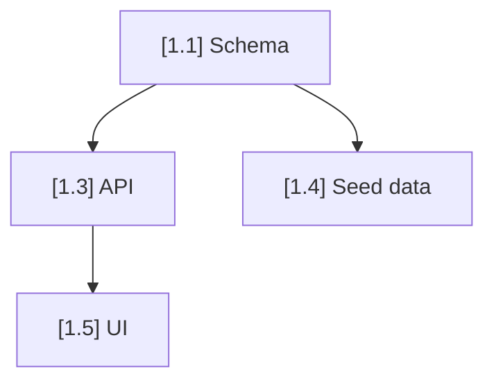

# GSD to Linear — Create Agent-Ready Issues with Dependency Mapping

Convert GSD requirements into Linear issues with self-contained agent prompts, dependency mapping, and parallel execution groups. Every issue is a complete, independent work packet that any agent (Claude Code, Codex, Aider, Qwen, Jules) can pick up and execute without additional context.

Input: $ARGUMENTS (optional: project name override, default reads from `.planning/STATE.md`)

## Why This Exists

GSD requirements live in `.planning/REQUIREMENTS.md` — inside the repo, inside the context window. That works for a single agent in a single terminal. But when you want:
- 5 terminals running 5 agents in parallel
- To see progress from your phone
- Codex and Claude coordinating on the same task
- Dependency-aware parallel execution

You need requirements OUTSIDE the repo, in a shared coordination layer. Linear is that layer. The `linear` CLI is provider-agnostic — any agent that can run shell commands can read/write to it.

Adapted from:
- GSD requirements extraction (behavior language, independently testable)
- Adversarial build V2 (per-requirement isolation, TDD, adversarial review)
- Sprint loop V2 (machine-readable status, parallel execution)

## Process

### 1. Load GSD State

Read these files:
- `.planning/REQUIREMENTS.md` — source of truth for requirements
- `.planning/ROADMAP.md` — phase ordering and dependencies
- `.planning/STATE.md` — current phase and progress
- `.planning/requirements.json` — if exists, use structured format instead of markdown

Also read if they exist:
- `CLAUDE.md` or `.claude/CLAUDE.md` — project instructions agents will need
- `UBIQUITOUS_LANGUAGE.md` — domain terminology
- `.planning/data-requirements.md` — data context
- `.planning/ux-brief.md` — UX context
- `.planning/ui-brief.md` — UI context

If none of these exist, STOP: "No GSD state found. Run `/playbook:prd-to-gsd` first to create requirements."

### 2. Verify Linear CLI

```bash
linear auth whoami
linear team list
```

If either fails: STOP with "Linear CLI not authenticated. Run `linear auth login` first."

Detect the team key from `linear team list` (e.g., `DRS`). Store as TEAM_KEY.

### 3. Detect or Create Linear Project

```bash
linear project list
```

If project from $ARGUMENTS or `.planning/STATE.md` milestone name exists in Linear, use it.
If not, ask the user: "No matching Linear project found. Create '[milestone name]' in Linear? (y/n)"

Store as LINEAR_PROJECT.

### 4. Create Labels

Create labels for organizing issues (skip if they already exist):

```bash
linear label create --name "phase-N" --team [TEAM_KEY]    # One per phase
linear label create --name "parallel-group-A" --team [TEAM_KEY]  # Execution groups
linear label create --name "agent:builder" --team [TEAM_KEY]
linear label create --name "agent:reviewer" --team [TEAM_KEY]
linear label create --name "tdd" --team [TEAM_KEY]
linear label create --name "blocked" --team [TEAM_KEY]
```

### 5. Analyze Dependencies and Build Execution Groups

<HARD-GATE>
Do NOT create issues until the dependency map is complete. Issues without dependency context cannot be safely parallelized.
</HARD-GATE>

Read `.planning/ROADMAP.md` to understand phase ordering.
Read `.planning/REQUIREMENTS.md` to understand requirement ordering within phases.

Build a dependency map:

```
DEPENDENCY MAP:
Phase 1: [requirements] → no dependencies (start here)
Phase 2: [requirements] → depends on Phase 1
Phase 3a: [requirements] → depends on Phase 2, independent of 3b
Phase 3b: [requirements] → depends on Phase 2, independent of 3a
...
```

Group into PARALLEL EXECUTION GROUPS:

```
Group A (can run simultaneously — no interdependencies):
  - Requirement X (Phase 1)
  
Group B (can run simultaneously after Group A completes):
  - Requirement Y (Phase 2a)
  - Requirement Z (Phase 2b)

Group C (can run simultaneously after Group B completes):
  - ...
```

Rules for grouping:
- Requirements within the same phase that don't touch the same files/modules → PARALLEL
- Requirements that share database tables, API routes, or component trees → SEQUENTIAL
- Cross-phase requirements → always sequential (later phase waits for earlier)
- When unsure, mark as SEQUENTIAL (safer)

### 6. Break Requirements into Agent-Sized Subtasks

<HARD-GATE>
Every subtask MUST be small enough for one agent session. The test: if a subtask requires touching more than 3 files or writing more than 150 lines of new code, it's too big. Split it further.
</HARD-GATE>

For each requirement, analyze complexity and break into subtasks:

**Complexity heuristics (adapted from Taskmaster):**

| Signal | Complexity | Subtasks needed |
|--------|-----------|----------------|
| Single model/schema change | Simple | 1-2 subtasks |
| API endpoint + validation | Medium | 2-3 subtasks |
| Full feature (UI + API + DB) | Complex | 4-6 subtasks |
| Cross-cutting concern (auth, i18n) | Complex | 4-8 subtasks |
| Integration with external service | Complex | 3-5 subtasks |

**Subtask decomposition rules:**
- Each subtask touches 1-3 files maximum
- Each subtask is ~50-150 lines of new/modified code
- Each subtask has independently verifiable acceptance criteria
- Each subtask can be tested in isolation
- Schema/model subtasks come before API subtasks which come before UI subtasks
- Shared utilities/types come before the code that uses them

### 7. Generate Self-Contained Agent Prompts

For EACH subtask, generate a prompt that contains everything an agent needs.

**Subtask prompt template:**

```markdown
## Subtask: [Phase.Subtask] [Title]

**Parent:** [Parent issue ID] — [Requirement title]
**Depends on:** [List of subtask issue IDs, or "none — start immediately"]
**Estimated scope:** ~[N] lines across [N] files
**Linear Issue:** [ISSUE_ID]

---

### Context

Project: [name]
Phase: [N] — [phase title]
Stack: [detected from project files]
Test command: [detected or specified]
Type check: [detected or specified]

### Project Rules (relevant to this subtask)
[Extract ONLY the rules from CLAUDE.md that apply to this specific subtask]
[Include domain terms from UBIQUITOUS_LANGUAGE.md if relevant]

### What to Build

[Specific, concrete description of what this subtask produces]
[Name the exact files to create or modify, if known]

### Acceptance Criteria

- [ ] [Criterion 1 — verifiable by running a test]
- [ ] [Criterion 2 — verifiable by running a test]
- [ ] ...

### TDD Contract

Follow this exact sequence:
1. **RED:** Write failing tests that encode the acceptance criteria above
2. **GREEN:** Write the minimum code to make tests pass
3. **REFACTOR:** Clean up without changing behavior
4. Verify: `[test command]`
5. Type check: `[type check command]` (must exit 0)

### Files to Touch
- `[path/to/file1]` — [create / modify] — [what changes]
- `[path/to/file2]` — [create / modify] — [what changes]

### When Done
```bash
linear issue update [ISSUE_ID] --state "Done"
linear issue comment add [ISSUE_ID] --body "Complete. Tests: [added]/[total passing]. Files: [list]"
```

### If Stuck
```bash
linear issue update [ISSUE_ID] --state "Blocked"
linear issue comment add [ISSUE_ID] --body "BLOCKED: [what's blocking]"
```
```

### 8. Create Linear Issues

**Step 8a: Create parent issues (one per GSD requirement)**

```bash
linear issue create \
  --team [TEAM_KEY] \
  --project "[LINEAR_PROJECT]" \
  --title "[Phase N] [Requirement title]" \
  --description-file /tmp/linear-parent-N.md \
  --label "phase-[N]" \
  --priority [1-4 based on phase] \
  --no-interactive
```

Capture the parent issue ID (e.g., `DRS-20`).

**Step 8b: Create subtask issues (as sub-issues of the parent)**

```bash
linear issue create \
  --team [TEAM_KEY] \
  --project "[LINEAR_PROJECT]" \
  --title "[N.M] [Subtask title]" \
  --description-file /tmp/linear-subtask-N-M.md \
  --parent [PARENT_ISSUE_ID] \
  --label "phase-[N]" \
  --label "group-[letter]" \
  --label "tdd" \
  --priority [same as parent] \
  --no-interactive
```

**Step 8c: Create dependency relations**

```bash
linear issue relation add [SUBTASK_ID] blocked-by [DEPENDENCY_ID]
```

### 9. Generate Execution Plan

Create `.planning/linear-execution-plan.md`:

```markdown
# Linear Execution Plan — [Milestone Name]

Generated: [date]
Project: [LINEAR_PROJECT]
Team: [TEAM_KEY]

## Summary

| Metric | Count |
|--------|-------|
| Phases | [N] |
| Parent issues (requirements) | [N] |
| Subtask issues | [N] |
| Execution groups | [N] |
| Max parallel agents | [N] (largest group) |

## Dependency Map



## Parallel Execution Groups

### Group A — Start immediately (no dependencies)
| Issue | Title | Parent | Est. Lines | Files |
|-------|-------|--------|-----------|-------|
| DRS-21 | [1.1] Create schema | DRS-20 | ~60 | 2 |

### Group B — After Group A
| Issue | Title | Blocked By | Est. Lines | Files |
|-------|-------|-----------|-----------|-------|
| DRS-22 | [1.3] API endpoint | DRS-21 | ~120 | 2 |

[continue for all groups...]

## Sprint Executor Commands

### Run everything (respects group ordering):
```bash
./adapters/linear/parallel-sprint.sh --all
```

### Or run groups manually:
```bash
./adapters/linear/parallel-sprint.sh --group A
# wait for A to finish...
./adapters/linear/parallel-sprint.sh --group B
```
```

### 10. Commit and Report

```bash
git add .planning/linear-execution-plan.md
git commit -m "ops: linear execution plan for [milestone name]"
```

Report to user with summary of issues created, execution groups, and next steps.

## Rules

- NEVER create subtasks larger than ~150 lines of new code. If bigger, split further.
- NEVER create subtasks that touch more than 3 files. If more, split further.
- NEVER create issues without dependency relations — parallel execution without dependency awareness causes merge conflicts.
- ALWAYS include the full TDD contract in every subtask prompt.
- ALWAYS include Linear CLI completion commands in every subtask prompt.
- ALWAYS include the "If Stuck" protocol.
- ONE clear deliverable per subtask. Not two. Not "while I'm here."
- Parent issues are for TRACKING. Agents work on SUBTASKS, never on parents directly.
- Subtask order within a requirement: schema/types → utilities → API/logic → UI → integration tests.
