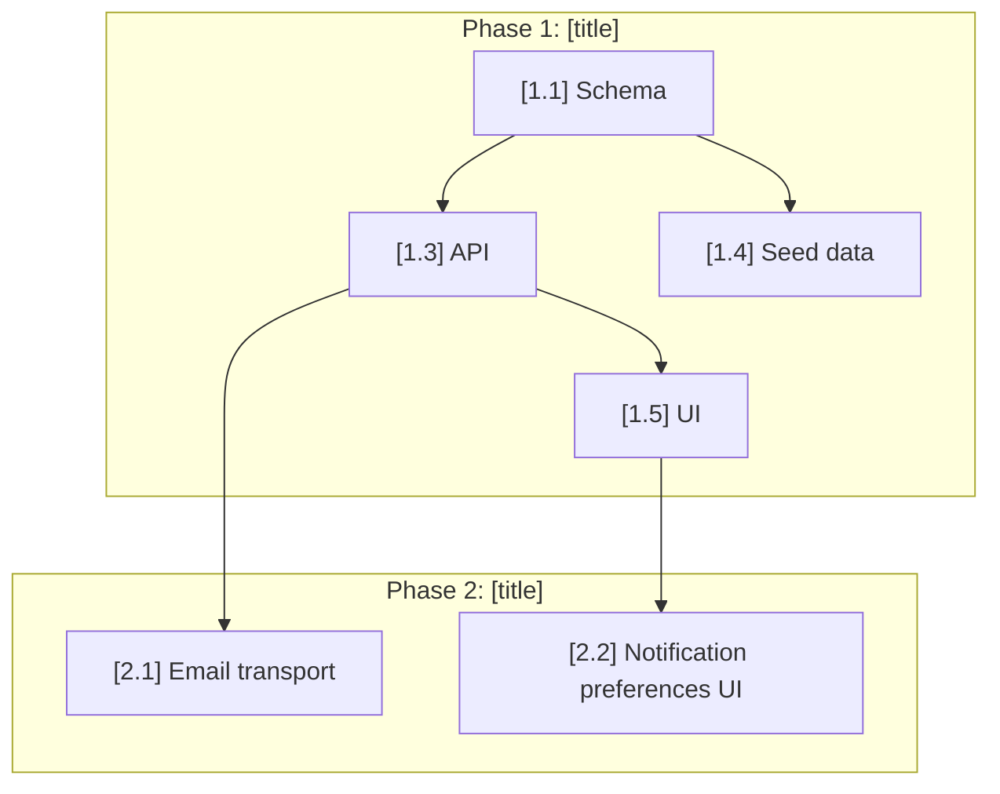

# PRD to Linear — Agent-Sized Issues with Dependency Mapping

Read a PRD and break it into small, agent-sized Linear issues organized as parent tasks with subtask sub-issues. Each subtask is a self-contained work packet — small enough that an agent won't hit context window problems, detailed enough that it can execute without asking questions.

Input: $ARGUMENTS (path to PRD file, GitHub issue number, or "latest" for most recent `.planning/decisions/` file)

## Why This Exists

Agents make mistakes when tasks are too large. A requirement like "Build the notification system" is 500+ lines of code across multiple files — too much for one agent session. The agent loses track, forgets constraints, introduces bugs.

The fix: break every requirement into subtasks of ~50-150 lines of code each. Each subtask touches 1-3 files, has clear acceptance criteria, and includes a TDD contract. This is what Taskmaster does for local task files — this command does it for Linear issues, so any agent (Claude Code, Codex, Aider, Qwen, Jules) can grab a subtask and execute it independently.

The structure in Linear:
```
Parent Issue: [Phase 1] Build notification system          ← milestone tracker
  └─ Sub-issue: [1.1] Create notification schema           ← agent executes this
  └─ Sub-issue: [1.2] Build notification API endpoint      ← agent executes this
  └─ Sub-issue: [1.3] Add notification UI component        ← agent executes this
  └─ Sub-issue: [1.4] Wire notification triggers           ← agent executes this
```

Parents track progress. Subtasks are what agents actually build.

Adapted from:
- Taskmaster's complexity analysis + subtask expansion
- Adversarial build V2's per-requirement isolation
- GSD's vertical slice phasing (tracer bullet first)

## Process

### 1. Load the PRD

Resolve the input:
- If a file path: read it directly
- If a GitHub issue number: `gh issue view $ARGUMENTS --json body -q '.body'`
- If "latest": find the most recent file in `.planning/decisions/`
- If no argument: check for `.planning/decisions/`, list available PRDs

Also load context if available (do NOT fail if missing — these are optional enrichment):
- `CLAUDE.md` — project instructions agents will need
- `UBIQUITOUS_LANGUAGE.md` — domain terminology
- `.planning/data-requirements.md` — data context
- `.planning/ux-brief.md` / `.planning/ui-brief.md` — design context
- `package.json` or equivalent — to detect test commands, frameworks, language

### 2. Readiness Gate

<HARD-GATE>
Do NOT create Linear issues from a PRD that hasn't been thought through. A vague PRD produces vague tasks produces agent failures.
</HARD-GATE>

Score the PRD on these dimensions (1-10):

| Dimension | What to check | Minimum |
|-----------|--------------|---------|
| **Problem clarity** | Is the problem specific and testable? | 7 |
| **User stories** | At least 5 concrete user stories? | 6 |
| **Scope boundaries** | "Out of scope" explicitly defined? | 6 |
| **Decision completeness** | Implementation decisions made, not deferred? | 5 |
| **Testability** | Acceptance criteria verifiable by test or browser? | 7 |

- **Average >= 6**: Proceed
- **Average 4-6**: Warn user, list weak areas, ask whether to proceed or grill more
- **Average < 4**: STOP. "This PRD needs more work. Run `/grill-me` first."

### 3. Verify Linear CLI

```bash
linear auth whoami
linear team list
```

If either fails: STOP with "Linear CLI not authenticated. Run `linear auth login` first."

Auto-detect TEAM_KEY from `linear team list`.

### 4. Detect or Create Linear Project

```bash
linear project list
```

Match project name from PRD title or ask user. If no match, offer to create:
```bash
# Note: if linear project create is not available, instruct user to create in Linear UI
```

Store as LINEAR_PROJECT.

### 5. Extract Phases (Vertical Slices)

From the PRD, extract 4-8 phases. Each phase is ONE demoable deliverable.

Rules:
- First phase = tracer bullet (thinnest end-to-end slice proving the architecture)
- Order by: dependencies first, then risk (high-risk early to fail fast)
- Each phase is a vertical slice, NOT a horizontal layer ("user can log in" not "build all API routes")
- Name phases as user-visible outcomes

Output format (internal, not written to file):
```
Phase 1: [User-visible outcome] — [which PRD stories this covers]
Phase 2: [User-visible outcome] — [which PRD stories this covers]
...
```

### 6. Break Phases into Agent-Sized Subtasks

<HARD-GATE>
This is the critical step. Every subtask MUST be small enough for one agent session. The test: if a subtask requires touching more than 3 files or writing more than 150 lines of new code, it's too big. Split it further.
</HARD-GATE>

For each phase, analyze complexity and break into subtasks:

**Complexity heuristics (adapted from Taskmaster):**

| Signal | Complexity | Subtasks needed |
|--------|-----------|----------------|
| Single model/schema change | Simple | 1-2 subtasks |
| API endpoint + validation | Medium | 2-3 subtasks |
| Full feature (UI + API + DB) | Complex | 4-6 subtasks |
| Cross-cutting concern (auth, i18n) | Complex | 4-8 subtasks |
| Integration with external service | Complex | 3-5 subtasks |

**Subtask decomposition rules:**
- Each subtask touches 1-3 files maximum
- Each subtask is ~50-150 lines of new/modified code
- Each subtask has independently verifiable acceptance criteria
- Each subtask can be tested in isolation (no "this works only when combined with subtask 3")
- Schema/model subtasks come before API subtasks which come before UI subtasks
- Shared utilities/types come before the code that uses them
- Each subtask specifies exact files to create or modify (if knowable from context)

**Subtask naming convention:**
```
[Phase.Subtask] Verb + specific object
Examples:
  [1.1] Create user notification preferences schema
  [1.2] Add POST /api/notifications endpoint with validation
  [1.3] Build NotificationCard component with dismiss action
  [2.1] Add email transport to notification dispatcher
```

### 7. Analyze Dependencies and Build Execution Groups

Map dependencies between ALL subtasks across ALL phases:

**Dependency rules:**
- Subtasks within a phase: usually sequential (schema → API → UI)
- Subtasks across phases: later phases depend on earlier phases completing
- Independent modules: can run in parallel even within the same phase
- When two subtasks touch the same file: SEQUENTIAL (merge conflict risk)
- When two subtasks touch the same **conflict domain**: SEQUENTIAL (see 7b below)
- When two subtasks are in different directories/modules: usually PARALLEL

Group into execution groups:
```
Group A (start immediately):
  [1.1] Create schema
  [1.2] Set up test infrastructure  ← different module, no conflict

Group B (after Group A):
  [1.3] Build API endpoint (needs schema from 1.1)
  [1.4] Build seed data (needs schema from 1.1)

Group C (after Group B):
  [1.5] Build UI component (needs API from 1.3)
  [2.1] Add email transport (needs schema from 1.1, independent of UI)

...
```

### 7b. Conflict Domain Analysis

<HARD-GATE>
Scan the actual codebase for shared files that multiple subtasks will touch. Subtasks modifying the same conflict domain MUST be in the same sequential execution group.
</HARD-GATE>

Scan the codebase for these conflict hotspots:

| Conflict Domain | Files to Check | Risk |
|-----------------|---------------|------|
| **Global CSS / Tailwind** | `globals.css`, `tailwind.config.*`, theme files | HIGH |
| **Barrel exports** | `index.ts`, `index.js` re-export files | HIGH |
| **Shared types** | `types.ts`, `types/index.ts`, shared interfaces | HIGH |
| **Database migrations** | `migrations/`, `schema.ts`, `drizzle/` | HIGH |
| **Router config** | `app/layout.tsx`, route configs, middleware | MEDIUM |
| **Package deps** | `package.json`, lock files | MEDIUM |
| **Shared components** | Layout, navigation, sidebar components | MEDIUM |

For each conflict domain found:
1. List which subtasks touch it
2. If >1 subtask touches the same domain → force SEQUENTIAL grouping
3. If a file is touched by >3 subtasks → recommend restructuring:

**Restructuring example (barrel exports):**
```
# BEFORE: single index.ts every feature modifies → merge conflict magnet
src/components/index.ts

# AFTER: per-feature modules that don't conflict
src/components/notifications/index.ts  ← feature A owns this
src/components/settings/index.ts       ← feature B owns this
```

Add a "Conflict Domains" section to the execution plan output (Step 10).

### 8. Generate Self-Contained Agent Prompts

For each SUBTASK, generate a prompt that contains everything an agent needs. No assumptions about context window contents.

**Subtask prompt template:**

```markdown
## Subtask: [Phase.Subtask] [Title]

**Parent:** [Parent issue ID] — [Phase title]
**Depends on:** [List of subtask issue IDs, or "none — start immediately"]
**Estimated scope:** ~[N] lines across [N] files
**Linear Issue:** [ISSUE_ID]

---

### Context

Project: [name]
Phase: [N] — [phase title]
Stack: [detected from package.json / project files]
Test command: [detected or specified]
Type check: [detected or specified]

### Project Rules (relevant to this subtask)
[Extract ONLY the rules from CLAUDE.md that apply to this specific subtask]
[Include domain terms from UBIQUITOUS_LANGUAGE.md if relevant]

### What to Build

[Specific, concrete description of what this subtask produces]
[Name the exact files to create or modify, if known]
[Reference specific patterns from the existing codebase if applicable]

### Acceptance Criteria

- [ ] [Criterion 1 — verifiable by running a test]
- [ ] [Criterion 2 — verifiable by running a test]
- [ ] [Criterion 3 — verifiable by checking in browser, if UI]

### TDD Contract

Follow this exact sequence:
1. **RED:** Write failing tests that encode the acceptance criteria above
2. **GREEN:** Write the minimum code to make tests pass
3. **REFACTOR:** Clean up without changing behavior
4. Verify: `[test command]`
5. Type check: `[type check command]` (must exit 0)

### Files to Touch
- `[path/to/file1]` — [create / modify] — [what changes]
- `[path/to/file2]` — [create / modify] — [what changes]

### When Done
```bash
linear issue update [ISSUE_ID] --state "Done"
linear issue comment add [ISSUE_ID] --body "Complete. Tests: [added]/[total passing]. Files: [list]"
```

### If Stuck
```bash
linear issue update [ISSUE_ID] --state "Blocked"
linear issue comment add [ISSUE_ID] --body "BLOCKED: [what's blocking]"
```
```

### 9. Create Linear Issues

**Step 9a: Create parent issues (one per phase)**

```bash
cat > /tmp/linear-phase-N.md << 'PROMPT'
# Phase N: [Phase title]

[Phase description — what's demoable when all subtasks complete]

## Requirements covered
[List of PRD stories/requirements this phase addresses]

## Subtasks
[Will be linked as sub-issues below]
PROMPT

linear issue create \
  --team [TEAM_KEY] \
  --project "[LINEAR_PROJECT]" \
  --title "[Phase N] [Phase title]" \
  --description-file /tmp/linear-phase-N.md \
  --label "phase-[N]" \
  --priority [1 for phase 1, 2 for phase 2-3, 3 for phase 4+] \
  --no-interactive
```

Capture the parent issue ID (e.g., `DRS-20`).

**Step 9b: Create subtask issues (as sub-issues of the parent)**

```bash
cat > /tmp/linear-subtask-N-M.md << 'PROMPT'
[Full agent prompt from Step 8]
PROMPT

linear issue create \
  --team [TEAM_KEY] \
  --project "[LINEAR_PROJECT]" \
  --title "[N.M] [Subtask title]" \
  --description-file /tmp/linear-subtask-N-M.md \
  --parent [PARENT_ISSUE_ID] \
  --label "phase-[N]" \
  --label "group-[letter]" \
  --label "tdd" \
  --priority [same as parent] \
  --no-interactive
```

Capture each subtask issue ID.

**Step 9c: After ALL issues are created, update prompts with real IDs**

Go back through each subtask description and replace dependency placeholders with actual Linear issue IDs. Use `linear issue update` with `--description-file` to update.

**Step 9d: Create dependency relations**

```bash
# For each subtask that depends on another:
linear issue relation add [SUBTASK_ID] blocked-by [DEPENDENCY_ID]
```

### 10. Generate Execution Plan

Create `.planning/linear-execution-plan.md`:

```markdown
# Linear Execution Plan — [PRD Title]

Generated: [date]
Source PRD: [path or issue number]
Project: [LINEAR_PROJECT]
Team: [TEAM_KEY]

## Summary

| Metric | Count |
|--------|-------|
| Phases | [N] |
| Parent issues | [N] |
| Subtask issues | [N] |
| Execution groups | [N] |
| Max parallel agents | [N] (largest group) |

## Dependency Map



## Parallel Execution Groups

### Group A — Start immediately (no dependencies)
| Issue | Title | Parent | Est. Lines | Files |
|-------|-------|--------|-----------|-------|
| DRS-21 | [1.1] Create schema | DRS-20 | ~60 | 2 |
| DRS-28 | [1.2] Test infrastructure | DRS-20 | ~40 | 1 |

### Group B — After Group A
| Issue | Title | Blocked By | Est. Lines | Files |
|-------|-------|-----------|-----------|-------|
| DRS-22 | [1.3] API endpoint | DRS-21 | ~120 | 2 |
| DRS-23 | [1.4] Seed data | DRS-21 | ~50 | 1 |

### Group C — After Group B
| Issue | Title | Blocked By | Est. Lines | Files |
|-------|-------|-----------|-----------|-------|
| DRS-24 | [1.5] UI component | DRS-22 | ~100 | 2 |
| DRS-25 | [2.1] Email transport | DRS-22 | ~80 | 2 |

[continue for all groups...]

## Sprint Executor Commands

### Group A (2 agents in parallel):
```bash
./adapters/linear/parallel-sprint.sh --group A
# Or manually:
./adapters/linear/sprint-executor.sh DRS-21 &
./adapters/linear/sprint-executor.sh DRS-28 &
wait
```

### Group B (2 agents in parallel, after A):
```bash
./adapters/linear/parallel-sprint.sh --group B
```

### Run everything (respects group ordering):
```bash
./adapters/linear/parallel-sprint.sh --all
```

### Mix agents for cost optimization:
```bash
# Complex subtasks → Claude (best quality)
BUILDER_AGENT=claude ./adapters/linear/sprint-executor.sh DRS-22

# Simple subtasks → free model via Aider
BUILDER_AGENT=aider AIDER_MODEL=openrouter/qwen/qwen3-coder-480b-free ./adapters/linear/sprint-executor.sh DRS-23

# Always review with a different model than the builder
REVIEWER_AGENT=codex  # default
```

### After all groups complete — integrate:
```bash
./adapters/linear/merge-coordinator.sh "[LINEAR_PROJECT]"
# Reviews integration branch, then merge to main when satisfied
```

## Monitor Progress

```bash
# Terminal
linear issue list --team [TEAM_KEY] --project "[LINEAR_PROJECT]" --sort priority --all-states

# Phone/Browser
# [Linear project URL]
```
```

### 11. Commit and Report

```bash
git add .planning/linear-execution-plan.md
git commit -m "ops: linear execution plan for [PRD title] — [N] phases, [M] subtasks"
```

Report:

```
PRD TO LINEAR — COMPLETE

Source: [PRD path or issue]
Project: [LINEAR_PROJECT]

CREATED:
  Parent issues (phases):  [N]
  Subtask issues:          [M]
  Dependency relations:    [K]
  Execution groups:        [G]

SUBTASK SIZING:
  Average est. lines/subtask:  [N]
  Max est. lines/subtask:      [N] ([issue ID])
  Subtasks touching 1 file:    [N]
  Subtasks touching 2-3 files: [N]

PARALLEL CAPACITY:
  Max simultaneous agents:     [N] (Group [X])
  Sequential groups:           [G]

NEXT STEPS:
  1. Review board: [Linear project URL]
  2. Start building: ./adapters/linear/parallel-sprint.sh --group A
  3. Or run everything: ./adapters/linear/parallel-sprint.sh --all

EXECUTION PLAN: .planning/linear-execution-plan.md
```

## Rules

- NEVER create subtasks larger than ~150 lines of new code. If a subtask is bigger, split it.
- NEVER create subtasks that touch more than 3 files. If it needs more, split it.
- NEVER skip the readiness gate — vague PRDs produce vague tasks produce agent failures.
- NEVER create issues without dependency relations — parallel execution without dependency awareness causes merge conflicts.
- ALWAYS use behavior language for parent issues, implementation language for subtasks. Parents say WHAT, subtasks say HOW.
- ALWAYS include the full TDD contract in every subtask prompt. Agents without TDD instructions skip tests.
- ALWAYS include Linear CLI completion commands in every subtask prompt. Agents that can't report status look stuck.
- ALWAYS include the "If Stuck" protocol. Silent failures waste compute.
- ONE clear deliverable per subtask. Not two. Not "while I'm here."
- Parent issues are for TRACKING. Agents work on SUBTASKS, never on parents directly.
- Subtask order within a phase: schema/types → utilities → API/logic → UI → integration tests.
- Priority mapping: Phase 1 parents = Urgent (1), Phase 2 = High (2), Phase 3+ = Medium (3). Subtasks inherit parent priority.
- If the PRD doesn't specify enough detail for subtask-level breakdown in some area, create the parent issue but flag it: "NEEDS REFINEMENT — subtasks cannot be created until [missing info] is decided."
